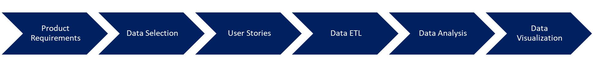
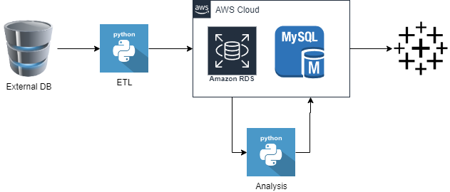
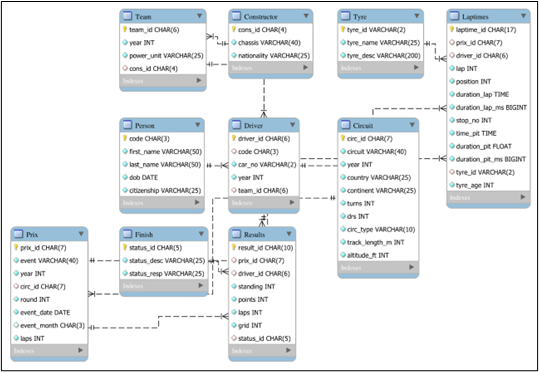
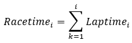
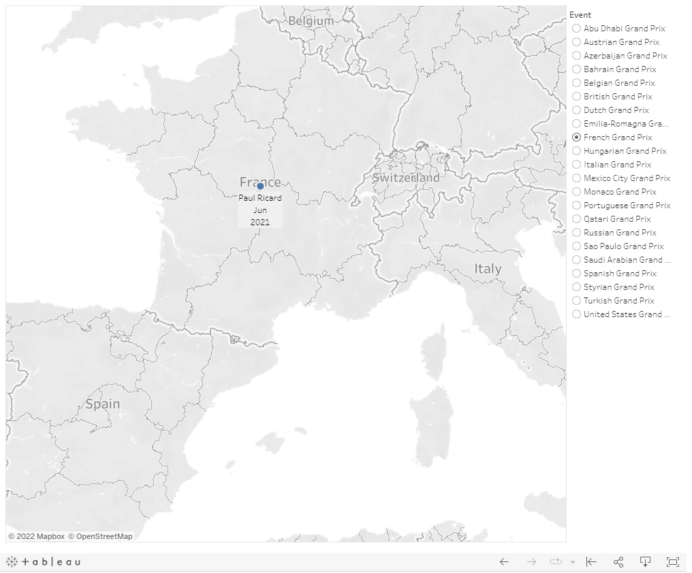
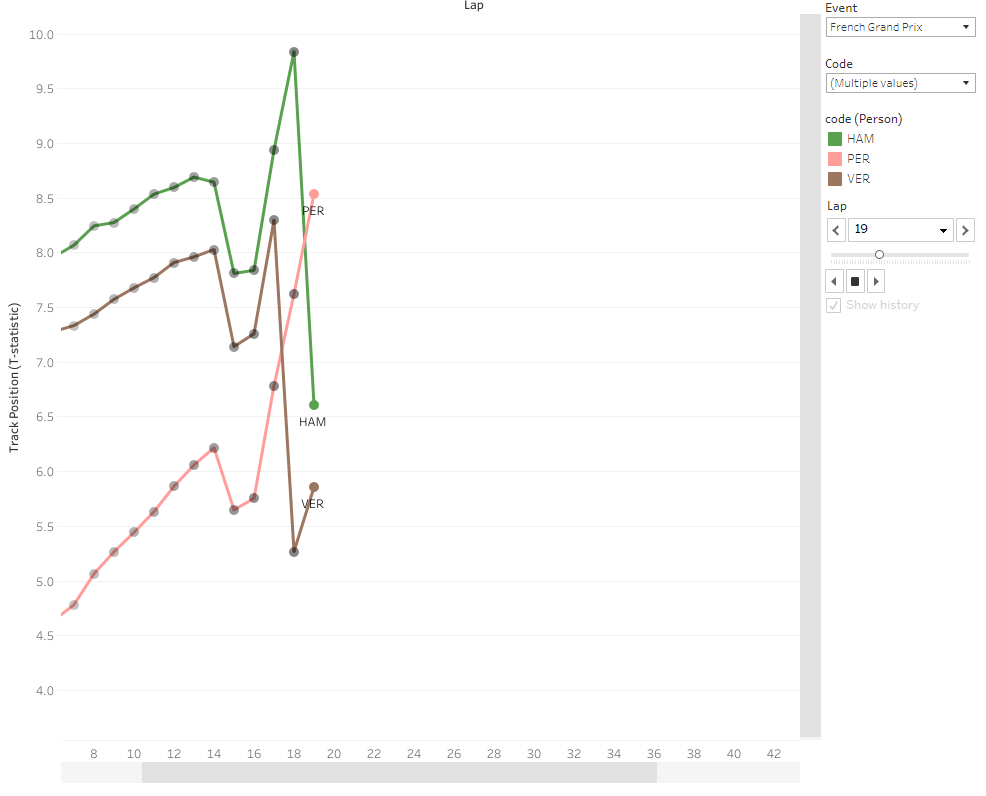
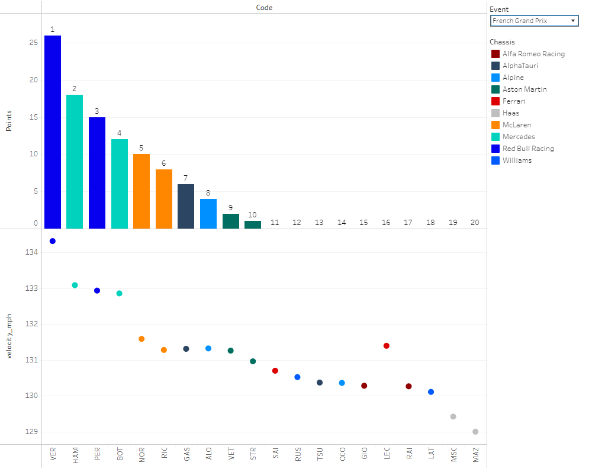

# F12021_Data_Analytics

A product for narrating the story of a race using race-data driven visualizations

Final Data Visualization available here (https://public.tableau.com/app/profile/vishal.kamalakannan/viz/2021F1Dashboard/2021Dashboard)

## Introduction:

During an F1 races every team makes numerous strategic decisions based on the track position and the lap-speed of each driver.
The lap-speed of each driver depends on the tyre used, tyre age, lap of the race and each driver's ambient conditions (for eg. traffic).
To get the full picture of a race, one needs to understand each aforementioned aspect of the race and there is no product built to demonstrate that.
This product fulfils the brief by narrating the story of the race.

## Overview:

## Product Requirements

After discussions with various Formula 1 fans, the following requirements were listed out:

- The product should allow the viewer to select the race he/ she wants to view
- The product should allow the viewer to select the drivers whose performance to view
- The product should display all the essential data required to understand the race story
- The product should summarise the results of the race beyond the points scored
- The product should be built at minimal cost
- The product should be easy to share over the internet

## Data Selection

The data required for the narration of each race includes:

- Laptimes
- Competing drivers
- Tyre strategy followed

The data is extracted from the following public sources:

- Ergast API (http://ergast.com/mrd/)
- Formula 1 (https://www.formula1.com/)
- Wikipedia (https://en.wikipedia.org/wiki/Formula_One)
- Racefans (https://www.racefans.net/)

## User Stories

After careful consideration, the following user stories have been authored:

- As a product user, I want to view the product on my browser, so I can access it from any device with no setup required
- As a product user, I want to view all the races on a world map, so I can pick and choose the race depending on the continent I am interested in
- As a product user, I want to view an interactive video of the race, so I can follow the race from start to finish
- As a product user, I want to focus on specific drivers, so I can compare the performance of drivers closely matched in the race
- As a product user, I want to view the summary at the end of the race, so I can understand the results of the race
- As a product owner, I want to host the data online, so anyone can access it from any device with no setup required at any time of the day
- As a product owner, I want the total cost to be zero, so I can build it with no sponsorship
- As a product owner, I want to manage the data in a normalized SQL schema, so I can update or add data with minimal system maintenance
- As a product owner, I want to share the product demonstration , so I can advertise it across mobile devices on chat applications
- As a product owner, I want to store user feedback in an organized way, so I can understand and implement user feedback

**Solution Design Diagram**

*A high level view of the solution design*

## Data ETL:

**Extraction:**

Ergast API enables the extraction of the data in an automated way. Data from the rest of the sources are copied manually.

**Transformation:**

The data is carefully studied and stored in a normalized SQL server.

*Normalized Schema of the server*

**Loading:**

The data is loaded into the SQL server as per the SQL Schema

## Data Analysis

**Track Position:**

The laptime data and pitstop time data is extracted from the Ergast database. A new column called racetime is defined for each lap as the rollup of all the laptimes until that lap.

For each lap of each grand prix, there are a maximum of 20 drivers who would have a Racetime statistic. To quantify the relative track position, a one-tailed student’s t statistic is calculated for each driver’s racetime. The higher the t-statistic, the farther ahead the driver is. For each entry in the Laptimes table, a corresponding T-statistic is stored.

**Lap Speed:**

The driving duration of each lap is calculated by subtracting the pitstop time from the laptime. This time is used to calculate the average velocity (mph) for that lap.
For each driver, the mean and standard deviation of the velocity is calculated and stored as entries in the Results database.

## Data Visualization

Tableau Public is used for visualization given its ease of use, no cost and high technical capabilities

*Race Selection*

*Race Narration*

*Race Summary*
